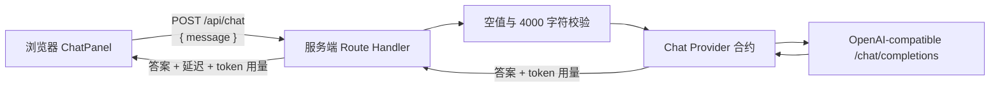

# Zhi Flow

Zhi Flow 是一个按里程碑推进的单用户 AI 聊天与 RAG 学习项目。当前完成到里程碑 03：浏览器可以通过服务端 API 发起一次非流式单轮聊天，观察端到端延迟与 token 用量；服务端已实现 OpenAI-compatible Chat Provider、超时和稳定错误分类。多轮上下文、流式输出、持久化、RAG 与供应商切换 UI 尚未实现。

## 本地启动

环境要求：Node.js 20.9 或更高版本、npm 11、Docker Desktop 或兼容的 Docker 运行时。

```bash
npm install
cp .env.example .env.local
npm run db:start
npm run db:reset
npm run dev
```

`npm run db:status` 会显示本地 Supabase 地址与开发密钥。将其中的 `API_URL` 和 `SECRET_KEY` 分别填入 `.env.local` 的 `ZHI_FLOW_SUPABASE_URL` 与 `ZHI_FLOW_SUPABASE_SECRET_KEY`。本地栈使用共享默认密钥且不具备生产安全加固，只能用于开发环境。

打开 [http://localhost:3000](http://localhost:3000)，或从命令行检查服务端路由：

```bash
curl http://localhost:3000/api/health
```

健康检查返回：

```json
{ "status": "ok", "service": "zhi-flow" }
```

单轮聊天也可以直接通过公开 HTTP 接缝观察：

```bash
curl http://localhost:3000/api/chat \
  -H 'Content-Type: application/json' \
  -d '{"message":"用三句话解释向量检索。"}'
```

成功响应只包含答案、端到端延迟和本次 token 用量，不包含模型名、供应商地址或密钥：

```json
{
  "answer": "...",
  "latencyMs": 842,
  "usage": { "inputTokens": 18, "outputTokens": 42, "totalTokens": 60 }
}
```

`.env.example` 只包含占位值。请在 `.env.local` 中替换它们，并且不要提交真实密钥。所有模型与供应商配置都使用不带 `NEXT_PUBLIC_` 前缀的服务端变量。

## 配置校验

启动与生产构建都会校验以下变量：

- `ZHI_FLOW_CHAT_API_KEY`
- `ZHI_FLOW_CHAT_BASE_URL`，必须是 HTTP(S) URL
- `ZHI_FLOW_CHAT_MODEL`
- `ZHI_FLOW_CHAT_TIMEOUT_MS`，可选的正整数毫秒值，默认 `15000`
- `ZHI_FLOW_SUPABASE_URL`，必须是 HTTP(S) URL
- `ZHI_FLOW_SUPABASE_SECRET_KEY`，只能由服务端读取

任何必需配置缺失或无效时，进程会在服务就绪前退出。错误只列出变量名，不打印配置值。

## 质量命令

```bash
npm run format        # 写入 Prettier 格式
npm run format:check  # 检查格式
npm run lint          # ESLint 静态检查
npm run typecheck     # TypeScript 类型检查
npm test              # Provider 合约、聊天 HTTP 与启动行为测试
npm run db:test       # 数据库约束、删除语义、种子和权限集成测试
npm run db:lint       # PostgreSQL 函数与迁移静态检查
npm run build         # Next.js 生产构建
npm run test:production-startup # 验证生产入口缺失配置时安全退出
npm run test:storage-boundary # 验证私有对象只能由服务端读取
npm run check         # 顺序运行全部检查、数据库测试、构建与边界验证
```

运行 `npm run check` 前需要先启动本地 Supabase，并在 `.env.local` 中提供全部服务端配置。`npm run test:client-boundary` 会检查生产构建中可下发给浏览器的静态产物和预渲染产物，确保它们不包含聊天或 Supabase 的服务端配置。

## 单轮聊天调用链与失败路径



公开 API 使用固定且脱敏的错误结构 `{ "error": { "code", "message", "retryable" } }`：

| 触发条件                       | HTTP | 应用错误码                       | 可重试 |
| ------------------------------ | ---: | -------------------------------- | ------ |
| 空输入或请求结构无效           |  400 | `INVALID_INPUT`                  | 否     |
| 超过 4000 个字符               |  400 | `INPUT_TOO_LONG`                 | 否     |
| 供应商超时                     |  504 | `PROVIDER_TIMEOUT`               | 是     |
| 供应商 401/403                 |  502 | `PROVIDER_AUTHENTICATION_FAILED` | 否     |
| 供应商 429                     |  429 | `RATE_LIMITED`                   | 是     |
| 供应商 5xx、网络失败或畸形响应 |  502 | `PROVIDER_UNAVAILABLE`           | 是     |

`FakeChatProvider` 通过相同的 `ChatProvider.complete({ message })` 合约返回可控结果，并记录收到的请求，适合快速观察消息结构和用量映射。自动测试还会启动本地假 OpenAI-compatible HTTP 上游，以覆盖真实适配器的请求体、Authorization 头、超时与错误映射；它不会访问真实模型。

真实 Provider 仅做显式手动 smoke：在 `.env.local` 填入真实的 base URL、API key 和模型后启动应用，通过页面或上述 `curl` 发送一条消息，再比较回答、延迟和 token 用量。不要把真实密钥、供应商响应正文或 smoke 结果提交到仓库。

## 数据库迁移与观察

```bash
npm run db:reset # 删除本地数据库，重放全部迁移，再加载 seed.sql
npm run db:clean # 删除本地数据库，重放迁移但不加载样例数据
npm run db:reset # 恢复可观察的最小种子数据
npm run db:stop  # 停止本项目的本地 Supabase 容器
```

核心关系是：Knowledge Base 级联拥有 Document，Document 级联拥有 Document Chunk；Conversation 拥有 Message；RAG Run 将同一 Conversation 的用户 Message 与助手 Message 配对；Citation 同时绑定 RAG Run、助手 Message 和同一 Knowledge Base 的真实 Document Chunk。删除 Document 会同步移除 Chunk、向量和 Citation，但保留 RAG Run 调试记录；删除用户 Message 会级联其助手尝试与 RAG Run；确认删除 Knowledge Base 后，其 Document、Chunk、绑定的 Conversation、Message、RAG Run 和 Citation 会一并删除。

`supabase/seed.sql` 提供一组固定 UUID 的完整关系样例和全零 1024 维向量，只用于观察关系，不连接真实模型。`documents` Storage bucket 由迁移创建，限制为 20 MiB 的 PDF、Markdown 或 TXT，保持私有且不向客户端角色授予策略。

## 运行边界

- `src/components/chat-panel.tsx` 是 Client Component，只持有当前输入、答案与请求状态；它只消费公开聊天 HTTP 协议。
- `src/app/api/health/route.ts` 是服务端 Route Handler，通过 HTTP 返回最小健康状态。
- `src/app/api/chat/route.ts` 是非流式单轮聊天的唯一公开入口，负责输入校验、延迟记录与脱敏错误映射。
- `src/server/chat/` 定义 Provider 合约、可控假 Provider 与 OpenAI-compatible 实现；供应商配置只从服务端配置进入真实实现。
- `src/server/config-definition.ts` 是唯一配置定义与校验入口；`next.config.ts` 在启动阶段调用它，`src/server/config.ts` 为后续服务端业务提供只读配置。
- `src/server/supabase.ts` 是服务端特权数据客户端入口；禁用会话持久化，不提供浏览器端 Supabase 客户端。
- `.env.local`、`src/server/` 和模型配置不会成为客户端 API；前端只消费稳定的产品概念与 HTTP 协议。
